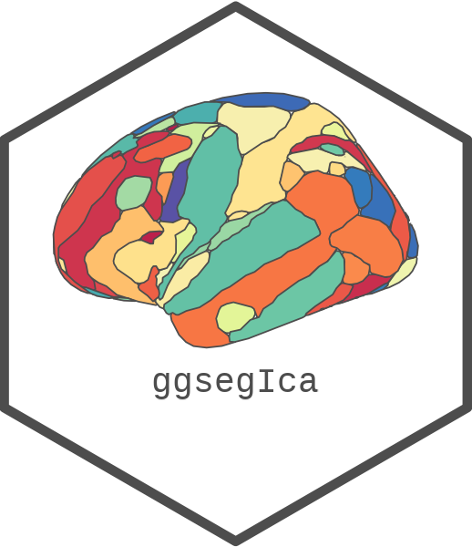
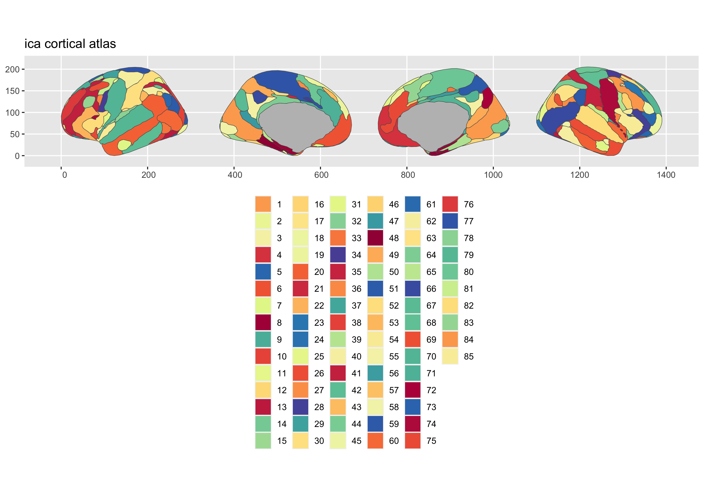
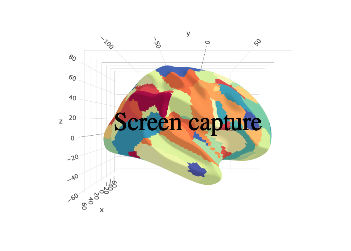

<!-- README.md is generated from README.Rmd. Please edit that file -->

# ggsegIca 

<!-- badges: start -->

[](https://github.com/ggseg/ggsegIca/actions)
<!-- badges: end -->

This package contains dataset for plotting the [ica](add%20url%20here)
atlas ggseg and ggseg3d.

Beckmann, C. F., & Smith, S. M. (2004). Probabilistic independent
component analysis for functional magneticresonance imaging. IEEE
transactions on medical imaging, 23(2), 137-152.
[IEEEE](https://ieeexplore.ieee.org/document/1263605)

To learn how to use these atlases, please look at the documentation for
[ggseg](https://ggseg.github.io/ggseg/) and
[ggseg3d](https://ggseg.github.io/ggseg3d)

## Installation

We recommend installing the ggseg-atlases through the ggseg
[r-universe](https://ggseg.r-universe.dev/ui#builds):

``` r
# Enable this universe
options(repos = c(
    ggseg = 'https://ggseg.r-universe.dev',
    CRAN = 'https://cloud.r-project.org'))

# Install some packages
install.packages('ggsegIca')
```

You can install the released version of ggsegIca from
[GitHub](https://github.com/) with:

``` r
# install.packages("remotes")
remotes::install_github("ggseg/ggsegIca")
```

``` r
library(ggseg)
#> Loading required package: ggplot2
library(ggseg3d)
library(ggsegIca)

plot(ica) +
  theme(legend.position = "bottom", 
        legend.text = element_text(size = 9)) +
  guides(fill = guide_legend(ncol = 6))
```



``` r
library(dplyr)
ggseg3d(atlas = ica_3d) %>% 
  add_glassbrain() %>% 
  pan_camera("right lateral")
```



Please note that the ‘ggsegIca’ project is released with a [Contributor
Code of Conduct](CODE_OF_CONDUCT.md). By contributing to this project,
you agree to abide by its terms.
