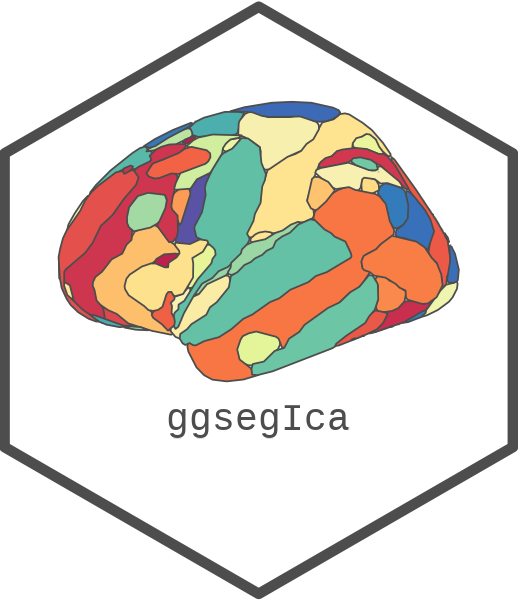

<!-- README.md is generated from README.qmd. Please edit that file -->

```{r}
#| label: setup
#| include: false
knitr::opts_chunk$set(
  collapse = TRUE,
  comment = "#>",
  fig.path = "man/figures/README-",
  out.width = "100%",
  fig.width = 10,
  fig.retina = 3
)
```

# ggsegIca 

<!-- badges: start -->
[](https://github.com/ggseg/ggsegIca/actions)
[](https://zenodo.org/badge/latestdoi/417492385)
<!-- badges: end -->

This package contains dataset for plotting the ICA atlas for ggseg.

Beckmann, C. F., & Smith, S. M. (2004).
Probabilistic independent component analysis for functional magnetic resonance imaging. IEEE transactions on medical imaging, 23(2), 137-152.
[IEEE](https://ieeexplore.ieee.org/document/1263605)

To learn how to use these atlases, please look at the documentation for [ggseg](https://ggseg.github.io/ggseg/)

## Installation

We recommend installing the ggseg-atlases through the ggseg [r-universe](https://ggseg.r-universe.dev/ui#builds):

```{r}
#| label: install-r-universe
#| eval: false
options(repos = c(
  ggseg = "https://ggseg.r-universe.dev",
  CRAN = "https://cloud.r-project.org"
))

install.packages("ggsegIca")
```

You can install from [GitHub](https://github.com/) with:

``` r
# install.packages("remotes")
remotes::install_github("ggseg/ggsegIca")
```

## Example

```{r}
#| label: 2d-plot
#| fig-height: 7
library(ggsegIca)
library(ggseg)

plot(ica())
```

Please note that the 'ggsegIca' project is released with a
[Contributor Code of Conduct](CODE_OF_CONDUCT.md).
By contributing to this project, you agree to abide by its terms.
